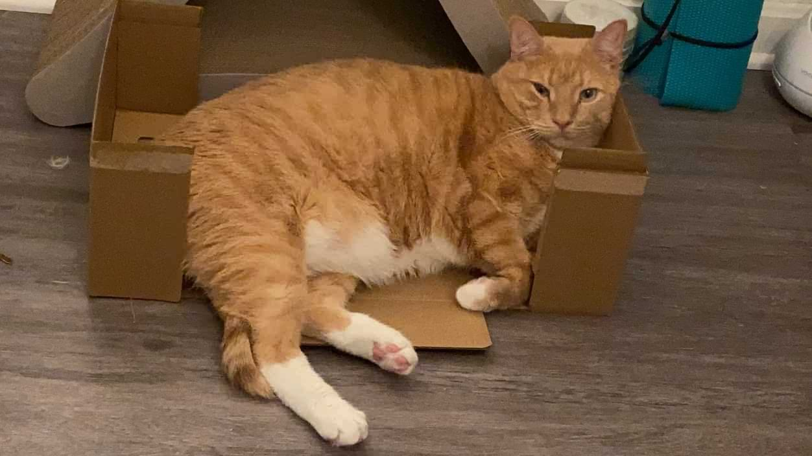

### Hi there 👋

- I'm pursuing a double degree in Computer Science:Machine Learning and Math:Statistics at University of Maryland as undergraduate student
- I'm currently working on Monocular 3D object Detection and violin pose estimation
- Fun fact: I have a cat called 大橘, "Big Orange" in English. He's big and orange, so....

<!--
**syKevinPeng/syKevinPeng** is a ✨ _special_ ✨ repository because its `README.md` (this file) appears on your GitHub profile.

Here are some ideas to get you started:

- 🔭 I’m currently working on ...
- 🌱 I’m currently learning ...
- 👯 I’m looking to collaborate on ...
- 🤔 I’m looking for help with ...
- 💬 Ask me about ...
- 📫 How to reach me: ...
- 😄 Pronouns: ...
- ⚡ Fun fact: ...
-->
